Vandaag leer je programmeren.  Je leert hoe je vanuit een software programma lampjes kan aansturen.  Met die lampjes kan je bijvoorbeeld een verkeerslicht maken.

## Bouwblokken

We gaan vandaag op een bijzondere computer werken: een *Raspberry Pi*.  Dat is een erg kleine computer die je toelaat andere dingen, zoals lampjes, aan te sturen.

Bovenop die computer gebruiken we een *Traffic Hat*.  Dit bordje heeft 3 LEDs, een drukknop en een zoemer.  Al die dingen zijn 
verbonden met de computer en kan je vanop de computer besturen.

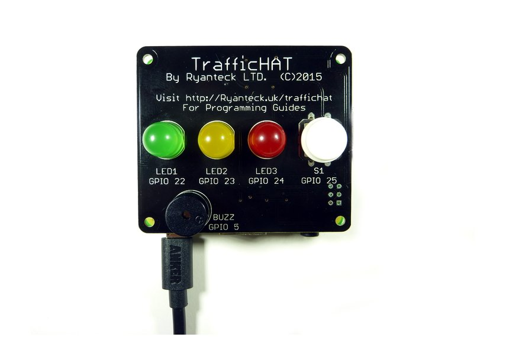

Op de computer gaan we software schrijven.  Dat doen we in een taal die *Scratch* noemt.  Je kan met Scratch programma's maken zoals spelletjes.  Je kan met Scratch op een Raspberry Pi ook de lichtjes, zoemer en drukknop van het verkeerslicht aansturen.

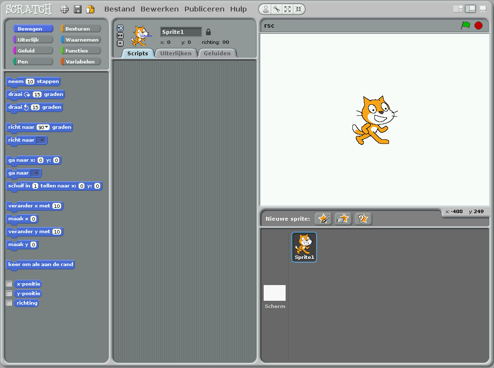

## Scratch

Je kan Scratch starten door op je bureaublad op het kat icoontje te drukken.

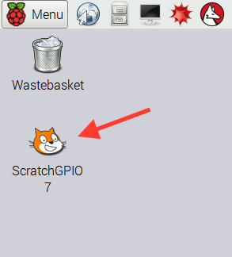

Je krijgt dan dit te zien

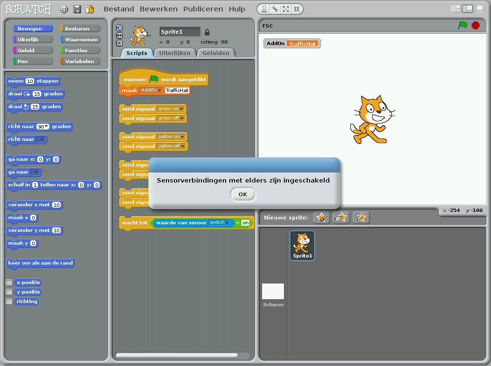

Die boodschap wil zeggen dat Scratch klaar is om je verkeerslicht aan te sturen.  Dit is een Scratch venster waarin de bouwblokken voor het verkeerslicht al gemaakt zijn.

Om Scratch samen met het verkeerslicht te gebruiken moet je deze blokjes altijd in je programma hebben staan.  Ze vertellen Scratch dat je met een TrafficHat zal werken.

### Scratch blokjes

Elk van die blokjes is een instructie voor je computer.  Als je blokjes aan elkaar hangt zullen ze in die volgorde uitgevoerd worden.

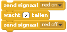

Deze blokjes zullen bijvoorbeeld eerst het rode lampje aanzetten.  Daarna 2 tellen wachten en dan het rode lampje terug uitschakelen.

### Herhalen

Je kan het uitvoeren van blokjes herhalen.  Het programma hieronder zal het rode lichtje 10 keer laten knipperen.  Het `herhaal` blok herhaalt de blokjes die er in zitten 10 keer.

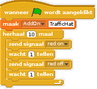

### Kiezen

Je kan in je programma ook keuzes maken.  In het programma hieronder vraagt de
Scratch kat aan de gebruiker welke kleur er moet gaan branden.  Daarna kiest
het programma op basis van het antwoord welk lichtje gaat branden.

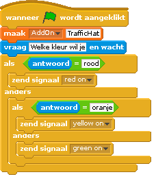

### Lichtjes bedienen

Je kan de lichtjes bedienen door een *signaal* te verzenden.  Dat signaal is dan een kleur ( `red`, `green`, `orange` ) samen met `on` om de lamp aan te zetten of `off` om de lamp uit te zetten.

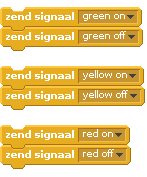

### Zoemer bedienen

De zoemer bedien je net zoals de lichtjes.  Je stuurt een signaal naar de `buzzer`.  Gebruik de zoemer niet te vaak, anders gaat iedereen vanavond met hoofdpijn naar huis.

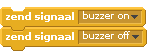

### Drukknop gebruiken

De drukknop gebruiken is wat moeilijker.  Je kan in je programma wachten tot er
op de drukknop gedrukt wordt.  Onderstaand voorbeeld zal bijvoorbeeld het rode
lampje laten branden totdat er op de knop gedrukt wordt.  Daarna gaat het
lampje 2 tellen uit en start het programma opnieuw.

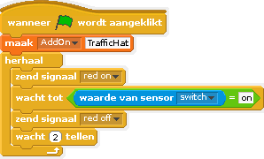

Ken je al een beetje Scratch en wil je met signalen werken?  Dat kan ook.  Je
kan je push button ook een signaal laten verzenden.  Dat doe je zo:

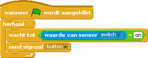

## Opdrachtjes

We starten allemaal samen met een eenvoudig voorbeeldje.  Daarna mag je bouwen
wat je wil.  Een verkeerslicht, een spelletje of iets anders.  Je kan de
lichtjes, de zoemer en de drukknop gebruiken zoals je zelf wil.  Als je niet
direct weet wat te doen hebben we hier zelf wat ideetjes.

### Een eenvoudig verkeerslicht

Maak een eenvoudig verkeerslicht dat:

1. Eerst 8 tellen rood is
2. Daarna 8 tellen groen is
3. Daarna 3 tellen oranje is
4. Terug rood wordt

Het verkeerslicht blijft zo maar verder veranderen in de volgorde die jij programmeert.

### Een verkeerslicht voor voetgangers

Maak een verkeerslicht voor voetgangers dat rood, groen en oranje wordt.  Wanneer het rood is, en de voetgangers dus niet mogen oversteken, kan je via de drukknop vragen om direct groen te worden.  Daarna moet het verkeerslicht opnieuw rood, groen en oranje worden.

### Een verkeerslicht voor blinden

Maak een verkeerslicht voor blinden.  Maak een verkeerslicht dat rood, groen en oranje wordt.  Wanneer iemand op de knop drukt zal tijdens de volgende groene periode de zoemer geluid maken.  Als niemand op de knop gedrukt heeft moet de zoemer geen geluid maken.

### Reactietijd testen

Maak een programma dat iemands reactietijd kan testen.  Laat eerst alle drie de lichtjes branden en doe ze daarna één voor één uit.  Wanneer het laatste lichtje uit is moet je zo snel mogelijk op de knop drukken.  Je programma meet de tijd.

### Simon Says

Maak een geheugen spelletje.  Je spelletje laat een aantal lampjes branden.  Elk lampje komt overeen met een toets op het toetsenbord (bijvoorbeeld rood: J, geel: K en groen: L).  De speler moet die toetsen in dezelfde volgorde indrukken om naar het volgende level te gaan.  In het volgende level zullen er meer lampjes gaan branden.
